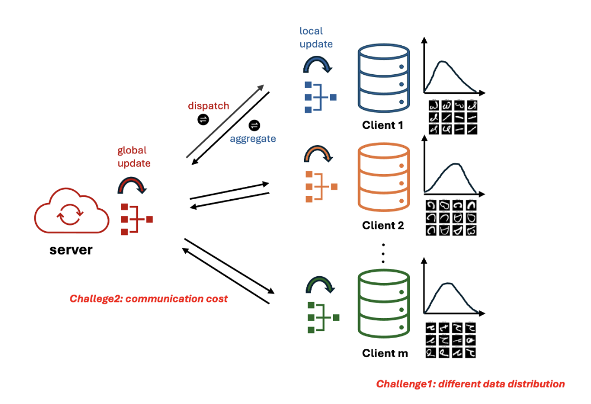

# Codebase for "Understanding the Accuracy-Communication Trade-off in Personalized Federated Learning"

Personalized federated learning (PFL) offers a flexible framework for aggregating information across distributed clients with heterogeneous data. This work considers a personalized federated learning setting that simultaneously learns global and local models. While purely local training has no communication cost, collaborative learning among the clients can leverage shared knowledge to improve statistical accuracy, presenting an accuracy-communication trade-off in personalized federated learning. However, the theoretical analysis of how personalization quantitatively influences sample and algorithmic efficiency and their inherent trade-off is largely unexplored. This paper makes a contribution towards filling this gap, by providing a quantitative characterization of the personalization degree on the tradeoff. The results further offers theoretical insights for choosing the personalization degree. As a side contribution, we establish the minimax optimality in terms of statistical accuracy for a widely studied PFL formulation. The theoretical result is validated on both synthetic and real-world datasets and its generalizability is verified in a non-convex setting.




## Folder Structure

Here’s the example structure of the repository:

```python
fedprox-bilevel/
├── data/                         # Directory for generated datasets (empty initially)
├── notebooks/                    # Jupyter notebooks for replicating experiments
├── src/                          # Core source code including data preprocessing, models, and trainers
├── requirements.txt              # Python dependencies
└── README.md                     # This file
```

## Usage

To run the experiments and replicate the results from the paper, navigate to the `notebooks` folder and use the corresponding Jupyter notebooks. The notebooks will guide you through generating datasets, training the models using the FedProx algorithm, and evaluating the results.

## Dependencies

This project uses Python with PyTorch as the primary framework. You can install the necessary dependencies by running:

```bash
pip install -r requirements.txt
```

## License

This project is licensed under the MIT License.
